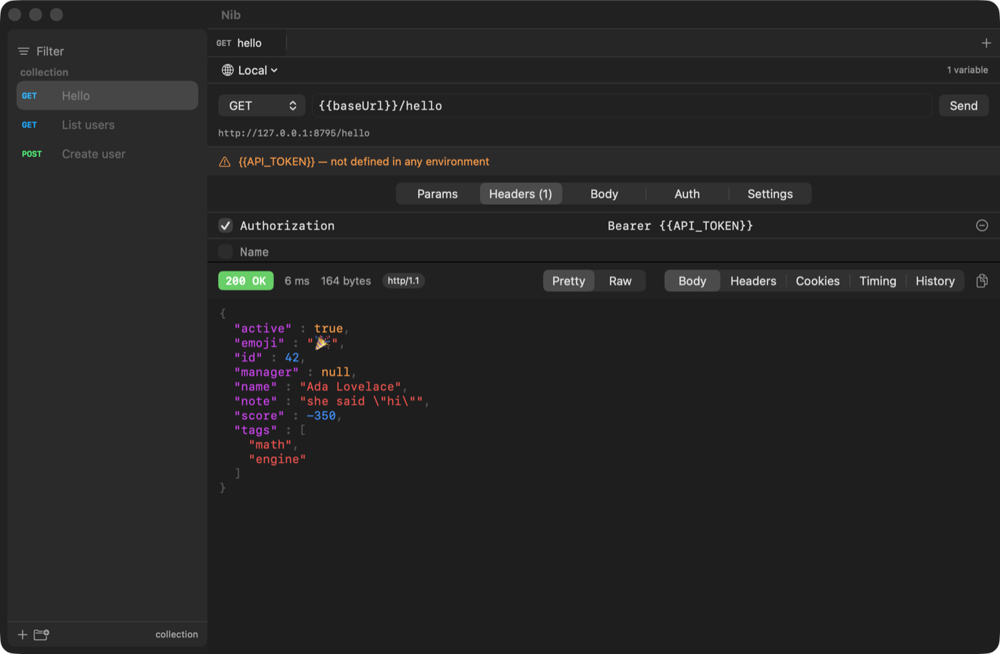

<p align="center">
  
</p>

<h1 align="center">Nib</h1>

<p align="center">A small, native API client for macOS.</p>

<!--
Three badges, no more. Two of them still need filling in before this goes public:
the Discord invite code, and the contact address. They're left blank rather than
guessed, since a dead invite link is worse than no badge.
-->
<p align="center">
  <a href="https://discord.gg/REPLACE-ME"></a>
  <a href="mailto:REPLACE-ME?subject=Nib"></a>
  <a href="LICENSE"></a>
</p>

<p align="center">
  
</p>

Nib is about 1.6 MB on disk and sits at roughly 30 MB of memory with a collection open. It's written in Swift against AppKit and SwiftUI, it has no third-party dependencies, and there's no account to create and nothing phoning home.

For a sense of scale, Postman 12.22.3 for Apple silicon is 353 MB installed, and 213 MB of that is the copy of Chromium it carries around. Both figures were measured rather than looked up; there's a note at the bottom about how.

## Features

- **Send requests.** Any method, query and path parameters, headers, and six kinds of body including multipart uploads.
- **Import from Postman.** A collection, an environment file, or an entire data-dump zip.
- **Requests as files.** One JSON file per request, in a folder you choose, so you can diff and commit them.
- **Environments.** Point `{{baseUrl}}` at localhost or staging without editing the request. Secrets go to the Keychain.
- **cURL in both directions.** Paste a command from your browser's devtools, or copy one back out.
- **Response detail.** Highlighted JSON, headers, cookies, the redirect chain, and timings from real URLSession metrics.
- **Keyboard shortcuts for everything**, and all of them appear in the menus so they're findable.

## Install

```sh
brew install nib-app/tap/nib
```

Nib is self-signed rather than notarized, so macOS quarantines it. The tap clears that flag during install and you shouldn't notice. If you'd rather grab the zip from the releases page, run this once afterwards:

```sh
xattr -dr com.apple.quarantine /Applications/Nib.app
```

Nib doesn't ask for any system permissions. There's no Accessibility prompt, no Input Monitoring, no Screen Recording, because it doesn't need any of them.

## Using it

Type a URL and press `⌘↩`.

After that, `⌘O` opens a folder as a collection, `⌘K` jumps to any request in it, `⌘E` edits environments and `⌘T` opens a new tab. [docs/keyboard.md](docs/keyboard.md) has the full list.

A collection is just a folder:

```
~/Work/acme-api/
├── collection.json
├── environments/Staging.env.json
└── Users/
    ├── folder.json
    ├── Create user.req.json
    └── Create user.req.body.json
```

Rename a file in Finder and it renames in the app. Edit a request body in vim and Nib picks up the change. Request bodies live in their own files rather than being escaped into a JSON string, which is the difference between a diff you can read and a single line of `"raw": "{\n \"a\"…"`.

Response history, cookies and window state don't go in that folder. They live in Application Support, because none of it belongs in your repository.

## Importing from Postman

Drop a Postman export anywhere on the window. Collection formats v2.1 and v2.0 both work, as do environment files and the zip that "Export Data" produces.

Nib doesn't run scripts. Rather than dropping them, it keeps pre-request scripts, tests, OAuth 2.0 configuration and proxy settings in a `preserved` block in your files, round-trips them untouched, and lists the affected requests after an import so you know what didn't come across.

Scripts might happen eventually. An account won't.

## Building from source

You'll need macOS 26 and Xcode 26.

```sh
make doctor    # tells you what your toolchain can and can't do
make check     # boundary checks, formatting, lint, 318 tests, size gate
make release   # produces a signed .app in dist/
```

The repository has no `.xcodeproj` in it. `make gen` generates one from `project.yml` using XcodeGen. Checking a project file in makes merge conflicts unreviewable and hides build settings from code review, which is where a size or signing regression would slip past.

## Contributing

> [!IMPORTANT]
> Please open an issue before a pull request. Nib is deliberately small, and there's a list of things that aren't going in.

That list lives in [CONTRIBUTING.md](CONTRIBUTING.md) along with the rest. Briefly: no new dependencies, no polling timers, and the last box on the pull request template asks you to explain what your change does and why in a paragraph. If that's hard to write, the change probably isn't ready.

## Licence

AGPL-3.0, in [LICENSE](LICENSE). Contributions come in under the [CLA](CLA.md), which exists so the licence can still be changed later if it ever needs to be. What it can't do is take your contribution private.

---

About those Postman numbers: they come from `du -sk` on Postman 12.22.3 downloaded from postman.com, with the Chromium version read out of its Electron framework. Nib's own numbers come from `make size`, `make measure` and `make memory` against the Release build, and CI checks them on every pull request. There's no memory comparison because Postman wouldn't launch on the machine we tried it on, and a number nobody measured isn't worth printing.
